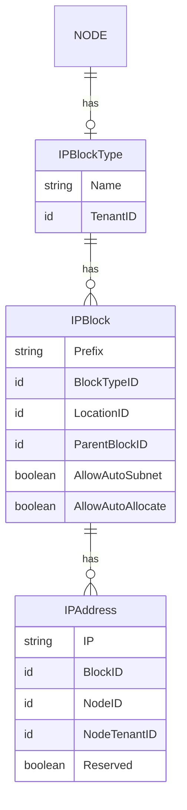

# Infratographer IP Address Management API

Infratographer IP Address Management implements a GraphQL API that provides a way to manage IP Addresses

## IPAM Structure




## Development and Contributing

- [Development Guide](docs/development.md)
- [Contributing](https://infratographer.com/community/contributing/)

## Example GraphQL Queries

### Create IP Block Mutation

Input:
```graphql
mutation{
  createIPBlockType(
    input: {
        name:"super-sweet-ip-block-type",
        tenantID:"tenants-df234a22-f849-11ed-b67e-0242ac120002"
    }
  )
  {
    ip_block_type{
      name,
      id
    }
  }
}
```

Output:
```json
{
  "data": {
    "createIPBlockType": {
      "ip_block_type": {
        "name": "super-sweet-ip-block-type",
        "id": "ipamibt-9xaBQDAFmLOdceu9zO6Rj"
      }
    }
  }
}
```

### Get IP Block by ID

Input:
```graphql
query{
  ip_block_type(id:"ipamibt-9xaBQDAFmLOdceu9zO6Rj"){
    name,
    id
  }
}
```

Output:
```json
{
  "data": {
    "ip_block_type": {
      "name": "super-sweet-ip-block-type",
      "id": "ipamibt-9xaBQDAFmLOdceu9zO6Rj"
    }
  }
}
```


## Code of Conduct

[Contributor Code of Conduct](https://infratographer.com/community/code-of-conduct/). By participating in this project you agree to abide by its terms.

## Contact

To contact the maintainers, please open a [GithHub Issue](https://github.com/infratographer/ipam-api/issues/new)

## License

[Apache 2.0](LICENSE)
